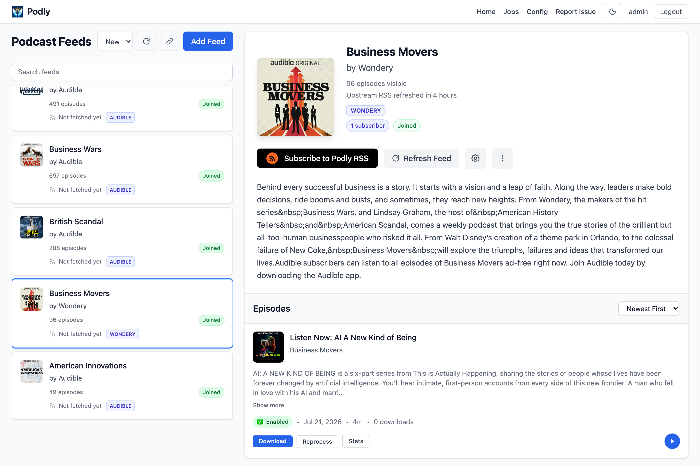

<h2 align="center">


</h2>

<p align="center">
<p align="center">Ad-block for podcasts. Create an ad-free RSS feed.</p>
<p align="center">
  <a href="https://discord.gg/FRB98GtF6N" target="_blank">
      
  </a>
</p>

## Overview

Podly uses Whisper and Chat GPT to remove ads from podcasts.



## This fork

Fork of [podly-pure-podcasts/podly_pure_podcasts](https://github.com/podly-pure-podcasts/podly_pure_podcasts) with fixes for upgrades and tighter ad removal. Published image:

```text
ghcr.io/tylermiranda/podly-pure-podcasts:main-latest
```

### Changes vs upstream

| Area | Change |
|------|--------|
| **Migrations** | Merges Alembic dual heads so existing DBs can upgrade (upstream [#234](https://github.com/podly-pure-podcasts/podly_pure_podcasts/issues/234)). |
| **Custom ad prompt** | Per-feed **Custom Ad Detection Instructions** in Feed Settings (`custom_llm_ad_prompt`), appended to the LLM system prompt during classification. |
| **Prompt tags** | Reusable prompt templates (e.g. `noiser`) managed under **Config → Prompt Tags** (also Feed Settings / Add Feed → Manage tags). Assign one tag per feed at add time or in settings; composition is `base → tag.prompt → per-feed custom`. |
| **Cut defaults** | New installs / reset defaults: `fade_ms=0` (was 3000), `min_ad_segment_length_seconds=5` (was 14), `min_confidence=0.7` (was 0.8). Existing DB values are unchanged until you update Output settings. |
| **Client poll freshness** | Feed list shows `Last fetched … via {client}` from the podcast app User-Agent that last requested the Podly RSS URL. |
| **Upstream freshness** | `last_fetched_at` (Podly → publisher RSS) is shown on the feed detail pane as `Upstream RSS refreshed …`. |

**Why the cut defaults matter:** a 3s fade leaves audible ad bleed at every cut; a 14s minimum length drops short prerolls. Prefer `fade_ms=0` and a lower length threshold when ads still play after processing. For host-read / network-specific patterns (e.g. Wondery / Noiser), assign a prompt tag or set a custom prompt on that feed and reprocess.

### Prompt tags (examples)

Create tags once under **Config → Default → Prompt Tags** (or **Manage tags** from Feed Settings / Add Feed), then assign **one tag per feed**. At classify time Podly builds the LLM instructions as:

```text
[global base ad-detection prompt]
+ [selected tag.prompt, if any]
+ [feed custom_llm_ad_prompt, if any]
```

Use a tag for patterns shared across a network or creator; use the per-feed custom field only for show-specific quirks.

**Example tags**

| Tag | Good for | Prompt gist |
|-----|----------|-------------|
| `wondery` | Wondery originals | Preroll network/show promo; midroll “brought to you by” host-reads; cross-promo for other Wondery titles. Keep narrative storytelling as content. |
| `noiser` | Noiser shows (`Short History Of…`, `Real Survival Stories`, …) | Preroll/partner blocks; midroll sponsor stings; other-Noiser cross-promo. Prefer cutting whole ad blocks, not leaving short sponsor tails. |
| `npr` | NPR / public radio | Short underwriting (“support for … comes from”), membership/NPR Plus pitches. Keep reporting and explainers. |
| `acquired` | Long-form host-read interview shows | Distinct midroll sponsor reads with promo codes/URLs; do not mark host banter or business analysis as ads. |

**Example tag prompt** (`noiser`):

```text
This is a Noiser production (e.g. Short History Of..., Real Survival Stories). Ads often:
- Open with a Noiser/network or partner preroll
- Use midroll host-read or produced sponsor blocks with clear 'ad break' pacing or stings
- Promote other Noiser shows at boundaries
Identify sponsor reads and promo blocks as ads. Preserve narrative history storytelling and
dramatic reenactment as content. Prefer cutting whole ad blocks rather than leaving short
sponsor tails at the edges.
```

**Example workflow**

1. Create tag `wondery` with the Wondery prompt above.
2. In each Wondery feed’s **Feed Settings**, set **Prompt tag** → `wondery` (or pick it when adding the feed).
3. Optionally add a per-feed custom line, e.g. `Also treat the cold-open Audible promo in the first 45s as an ad.`
4. Reprocess episodes so classification picks up the new instructions.

**API sketch** (authenticated session):

```bash
# Create a tag
curl -X POST "$PODLY/api/tags" -H 'Content-Type: application/json' \
  -d '{"name":"noiser","prompt":"This is a Noiser production..."}'

# Assign to a feed
curl -X PATCH "$PODLY/api/feeds/16/settings" -H 'Content-Type: application/json' \
  -d '{"prompt_tag_id":3}'
```

## How To Run

You have a few options to get started:

- [](https://railway.com/deploy/podly?referralCode=NMdeg5&utm_medium=integration&utm_source=template&utm_campaign=generic)
   - quick and easy setup in the cloud, follow our [Railway deployment guide](docs/how_to_run_railway.md). 
   - Use this if you want to share your Podly server with others.
- **Run Locally**: 
   - For local development and customization, 
   - see our [beginner's guide for running locally](docs/how_to_run_beginners.md). 
   - Use this for the most cost-optimal & private setup.
- **[Join The Preview Server](https://podly.up.railway.app/)**: 
   - pay what you want (limited sign ups available)


## How it works:

- You request an episode
- Podly downloads the requested episode
- Whisper transcribes the episode
- LLM labels ad segments
- Podly removes the ad segments
- Podly delivers the ad-free version of the podcast to you

### Cost Breakdown
*Monthly cost breakdown for 5 podcasts*

| Cost    | Hosting  | Transcription | LLM    |
|---------|----------|---------------|--------|
| **free**| local    | local         | local  |
| **$2**  | local    | local         | remote |
| **$5**  | local    | remote        | remote |
| **$10** | public (railway)  | remote        | remote |
| **Pay What You Want** | [preview server](https://podly.up.railway.app/)    | n/a         | n/a  |
| **$5.99/mo** | https://zeroads.ai/ | production fork of podly | |


## Contributing

See [contributing guide](docs/contributors.md) for local setup & contribution instructions.
